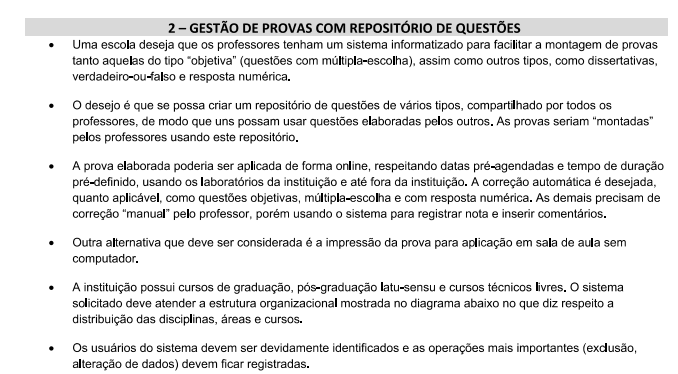

# Projeto DSW - Gestão de Provas com Repositório de Questões

### Funcionalidades

* Cadastrar Professores, Admistradores e Alunos
* Cadastrar questões no repositório
* Montar a prova
* Aplicar a prova
